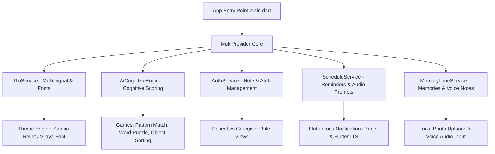

# 🛠️ Technical Framework Documentation
## Purb Chetana (পূৰ্ব চেতনা / பூர்ப் சேதனா) — AI Elderly Cognitive & Memory Assistance Platform

> **Target Demographic**: Elderly Dementia & Alzheimer's Patients in the North-Eastern Region (Assam, Meghalaya, Manipur, Tripura, etc.) & Tamil Nadu, along with their family caretakers.

---

## 📐 1. System Architecture Overview

Purb Chetana is built as a **hybrid multi-platform application** operating synchronously across Flutter (Android, iOS, Web) and a progressive HTML5/CSS3 web runtime.



---

## 🎨 2. Design System & Accessibility Palette

Designed specifically following Alzheimer's Society & W3C WCAG 2.1 AAA high-contrast accessibility guidelines for senior citizens with dementia.

| Design Token | Color Hex | Visual Purpose |
| :--- | :--- | :--- |
| **Primary Base** | `#61C5B0` | Soft Mint — Calm, high readability background accents |
| **Light Accent** | `#98DACB` | Light Pastel Mint — Subtle card boundaries & hover states |
| **Deep Primary** | `#23B39B` | Deep Mint Teal — High contrast buttons & actionable elements |
| **Background** | `#FDF0E6` | Soft Warm Peach Cream — Reduces blue-light eye strain |
| **Text Dark** | `#1B2824` | Deep Charcoal — Maximum legibility contrast against peach/mint |
| **Elder Buttons** | Radius 30px | Rounded pill touch targets (min 56px height) |

### Typography & Fonts
- **Primary Typography**: `Comic Relief` (imported via Google Fonts API and local fallbacks).
- **Tamil Regional Font**: `Vijaya.ttf` (76KB TrueType font registered in `pubspec.yaml` for Tamil script rendering without line truncation).

---

## 🌐 3. Internationalization (i18n) Engine

Managed via [`I1nService`](file:///home/dinakar3108/Downloads/PR1/lib/services/i18n_service.dart), a `ChangeNotifier` providing dynamic locale switching with live UI re-rendering.

- **Supported Languages**: English (`en`), Tamil (`ta`), Assamese (`as`), Bengali (`bn`), Manipuri (`mni`), Hindi (`hi`).
- **Dynamic Font Switching**:
  ```dart
  fontFamily: i18n.currentLang == 'ta' ? 'Vijaya' : 'Comic Relief',
  fontFamilyFallback: ['Vijaya', 'Comic Relief', 'Roboto']
  ```
- **Voice Synthesis (`flutter_tts`)**: Integrated text-to-speech engine configured to read out schedule reminders, memory stories, and game instructions in regional accents.

---

## 🧠 4. AI Cognitive Health Engine

Located in [`AiCognitiveEngine`](file:///home/dinakar3108/Downloads/PR1/lib/services/ai_cognitive_engine.dart). Evaluates 4 cognitive metrics:

1. **Memory Retention (35%)**: Evaluated through memory card matching and image-location recall games.
2. **Pattern Recognition (25%)**: Sequence completion and color/shape matching tests.
3. **Attention Span (20%)**: Speed and accuracy during interactive object identification.
4. **Reaction Speed (20%)**: Millisecond response latency measurements.

### Cognitive Index Score Formula
\[
\text{Cognitive Index} = (0.35 \times \text{Memory}) + (0.25 \times \text{Pattern}) + (0.20 \times \text{Attention}) + (0.20 \times \text{Speed})
\]

- **Adaptive Difficulty Adjustment**: Automatically modifies game grid size ($2\times 2$ up to $4\times 4$) and tile display speed based on rolling historical scores.

---

## 📸 5. Memory Lane & Caretaker Upload System

Located across [`MemoryLaneService`](file:///home/dinakar3108/Downloads/PR1/lib/services/memory_lane_service.dart), [`MemoryItem`](file:///home/dinakar3108/Downloads/PR1/lib/models/memory_item.dart), and [`MemoryLaneScreen`](file:///home/dinakar3108/Downloads/PR1/lib/screens/memory_lane_screen.dart).

### Dual-Tab Architecture
1. **🏛️ Public Places & Landmarks Tab**:
   - Curated historical & cultural landmarks (e.g. Kaziranga National Park, Living Root Bridges, Bihu Festivals).
   - Audio narration stories for nostalgic stimulation.
2. **📸 Personal Family Memories Tab**:
   - Caretaker upload option with **Photo Selector** (local asset & device gallery support).
   - **Integrated Audio Recorder Input**: Live voice recording (`Record Voice` / `Stop`) with visual recording indicators and test audio playback.
   - **Persistence**: Saved locally via `SharedPreferences` JSON serialization.

---

## ⏰ 6. Schedule & Reminders Engine

Managed by [`ScheduleService`](file:///home/dinakar3108/Downloads/PR1/lib/services/schedule_service.dart) and [`NotificationService`](file:///home/dinakar3108/Downloads/PR1/lib/services/notification_service.dart).

- **Categories**: Medication 💊, Hydration 💧, Exercises 🧘, Family Call 📞, Meals 🥗.
- **Local Push Notifications**: Uses `flutter_local_notifications` for scheduled alarms.
- **Audio Voice Alarms**: Plays regional audio prompts when notifications trigger.

---

## 🔒 7. Authentication & Role Control

Managed by [`AuthService`](file:///home/dinakar3108/Downloads/PR1/lib/services/auth_service.dart).

- **Dual Modes**:
  - **Elder Patient Mode**: Simplified UI, oversized touch targets, voice navigation, interactive games, memory lane.
  - **Caretaker Mode**: Password/PIN protected dashboard, cognitive index analytics, schedule manager, family memory uploader.
- **OTP Verification**: Simulated SMS OTP authentication flow for secure onboarding.

---

## 📁 8. Project Structure & Key Files

```
PR1/
├── assets/
│   ├── fonts/
│   │   └── Vijaya.ttf                 # Tamil script TrueType font
│   └── images/                        # High-resolution landmark & logo images
├── css/                               # HTML5/CSS3 runtime styling
│   ├── mobile.css                     # Main mobile CSS design system with Comic Relief
│   ├── games.css                      # Styling for cognitive web games
│   └── caregiver.css                  # Caregiver web dashboard styles
├── lib/
│   ├── main.dart                      # Flutter app initialization & theme builder
│   ├── models/
│   │   ├── memory_item.dart           # Memory item schema (Public & Caretaker)
│   │   └── schedule_item.dart         # Reminder schedule item data model
│   ├── services/
│   │   ├── i18n_service.dart          # Multilingual translations & TTS
│   │   ├── ai_cognitive_engine.dart   # Cognitive index scoring logic
│   │   ├── memory_lane_service.dart   # Memory state & audio recorder provider
│   │   ├── schedule_service.dart      # Reminder schedule state provider
│   │   ├── auth_service.dart          # Role switching & authentication
│   │   └── notification_service.dart  # Local alarms & push notification plugin
│   ├── screens/
│   │   ├── main_navigation_screen.dart# Elder bottom navigation bar container
│   │   ├── patient_home_screen.dart   # Patient quick-action dashboard
│   │   ├── memory_lane_screen.dart    # Public places & personal memory uploader
│   │   ├── caregiver_dashboard_screen.dart # Caregiver health analytics & management
│   │   ├── schedule_reminders_screen.dart  # Interactive reminder list
│   │   ├── games_hub_screen.dart      # Cognitive brain training hub
│   │   └── auth_onboarding_screen.dart# Phone OTP login & role selector
│   └── widgets/
│       ├── elder_button.dart          # 30px rounded pill button component
│       ├── elder_card.dart            # Accessibility card with soft drop shadows
│       └── cognitive_score_chart.dart # FlChart cognitive progress visualization
├── index.html                         # Web PWA application entry point
├── web/index.html                     # Flutter Web runner entry point
└── pubspec.yaml                       # Flutter dependencies & font asset configuration
```

---

## ⚡ 9. Verification & Build Commands

- **Syntax & Constraint Validation**:
  ```bash
  python3 full_dart_validator.py
  ```
- **Flutter Web / Local Run**:
  ```bash
  flutter run -d chrome
  ```
- **APK Production Build**:
  ```bash
  flutter build apk --release
  ```
